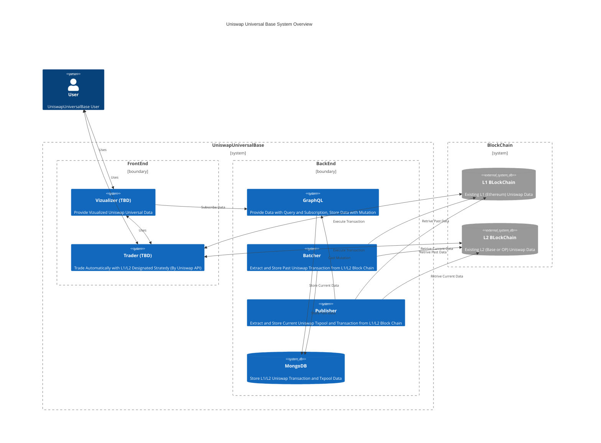
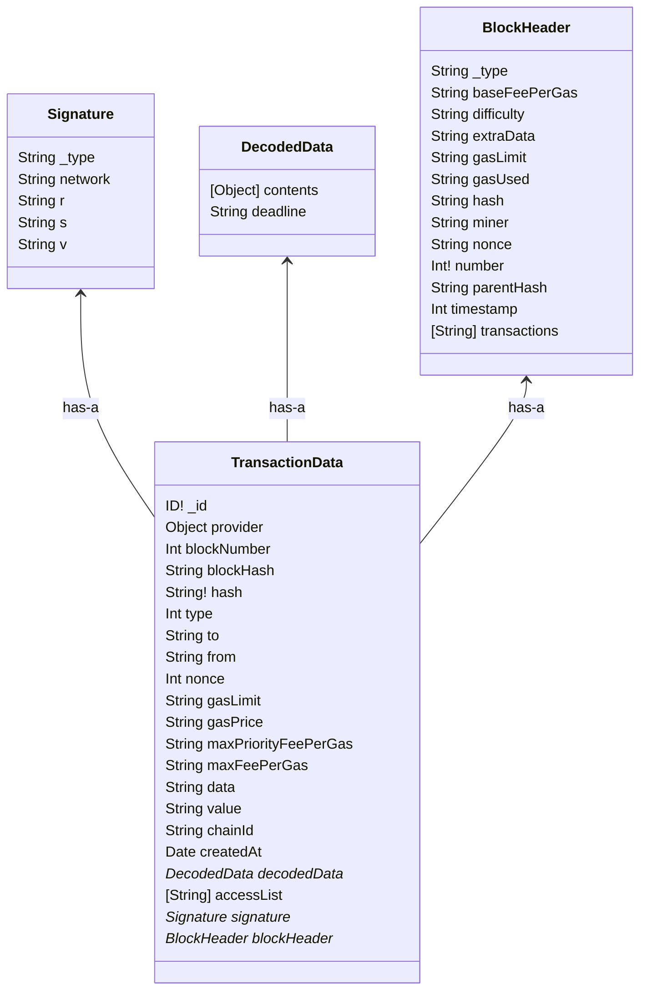

# uniswap-universal-base

## Demo Site
- https://universalbase.xyz/

Keeping storing decoded uniswap universal router txpool and transaction data, visualization, analyzing, and trading on the base
<p align="center">

</p>

## Uniswap Universal Base Overview

## Schemas


## Features
- Can Grasp Uniswap Universal Router Data Flow Correctly
- Can Grasp Uniswap Universal Router Data Statistically
- Can Have the Chances to Trade L1 and L2 Arbitration
- Can Use the Data as Machine or AI Learning

## Components

| Micro Services | Description  | 
| --- | --- | 
| MongoDB | Store Univerwap Universal Decoded Data from L1/L2 Blockchain | 
| [GraphQL](https://github.com/HiroyukiNaito/uniswap-universal-graphql) | Provide Subscriptions, Queries, Mutations for the System | 
| [Batcher](https://github.com/HiroyukiNaito/uniswap-universal-batcher) | Extract Past Universal Decoded Data from L1/L2 Blockchain and Store to MongoDB | 
| [Publisher](https://github.com/HiroyukiNaito/uniswap-universal-publisher) | Extract Current Universal Decoded Data from L1/L2 Blockchain and Publish Mutation to the GraphQL | 
| Vizualizer (TBD) | Vizualize Current and Past Uniswap Universal Router Data by Using the GraphQL | 
| Trader (TBD) | Trade by Using Vizualized and Airbitrary Data form Vizualizer and the GraphQL Data with L1/L2 Block Chain (RPC)  | 

## Installation

### 1. Install Docker
```bash
$ sudo apt install docker
```

### 2. Clone the repository

```bash
$ git clone https://github.com/HiroyukiNaito/uniswap-universal-base.git
```

### 3. Set the `.env` File for Your L1/L2 WebSocket RPC Endpoint and Universal Router Address

```bash
cd uniswap-universal-base
vi .env
```

- Universal Router Address is [here](https://docs.uniswap.org/contracts/v3/reference/deployments)

```bash
#Set Your Mongo DB Root User Name
ENV_MONGO_INITDB_ROOT_USERNAME=root

#Set Your Mongo DB Root User Password
ENV_MONGO_INITDB_ROOT_PASSWORD=password

#Set Your DB Name Which Store Uniswap Universal Router Decoded Data
ENV_MONGODB_DB=uniswapData

#Set Your DB User Name
ENV_MONGODB_USER=user

#Set Your DB Password
ENV_MONGODB_PASSWORD=password

# Set Uniswap L1 (Ethereum) Universal Router Address
ENV_UNIVERSAL_ROUTER_ADDRESS=0x3fC91A3afd70395Cd496C647d5a6CC9D4B2b7FAD

# Set Uniswap L2 (Base or Optimism) Universal Router Address
ENV_L2_UNIVERSAL_ROUTER_ADDRESS=0x198EF79F1F515F02dFE9e3115eD9fC07183f02fC

# Set Your L1 WebSocket RPC Endpoint 
ENV_RPC_WEBSOCKET_URL=wss://ethereum.publicnode.com

# Set Your L2 WebSocket RPC Endpoint 
ENV_L2_RPC_WEBSOCKET_URL=wss://base.publicnode.com

# Mutation Access Token
APP_SECRET=AccessToken
```

### 4. Set the `docker-compose.yml` File for Setting Job Range

- Setting part is [Here](https://github.com/HiroyukiNaito/uniswap-universal-base/blob/main/docker-compose.yml#L74)
- Detailed Description is [Here](https://github.com/HiroyukiNaito/uniswap-universal-batcher)
- Note: If you increase the frequency, it emit a lot requests to RPC Endpoints (i.e. Consume a lot of Resources)

```
$ vi docker-compose.yml
```
```
# Request block size in parallel (async)
BLOCK_RANGE_SIZE=1

# Retrive Days (from now)
RETRIEVE_DAYS=0.001

# Pause time per requests
WAIT_TIME=1000

# Request block size in parallel (async) in L2 block
L2_BLOCK_RANGE_SIZE=7

# Retrive Days (from now) in L2 block
L2_RETRIEVE_DAYS=0.001

# Pause time per requests in L2 block
L2_WAIT_TIME=1000
```

## Up and Running
- Run entire service 
```bash
$ docker compose up -d
```

- Run batch (If you want to obtain batch of data again after network troubles)
```bash
$ docker compose run -d batcher
```

- Checking container logs
```bash
$ docker compose logs -f --tail 100
```

## Service URLs

| Micro Services | URL  | 
| --- | --- | 
| [GraphQL](https://github.com/HiroyukiNaito/uniswap-universal-graphql) | http://localhost:4000/graphql| 
| Mongo DB Express  | http://localhost:8081 | 
| Mongo DB   | localhost:27017 | 
| Vizualizer (TBD) |  | 
| Trader (TBD) |   | 

## GraphQL Queries and Subscriptions 
- It will increase for developing Vizualizer.
- Several Queries and Subscriptions are available [here](https://github.com/HiroyukiNaito/uniswap-universal-graphql#7-subscriptions)

## Mongo Query Example

- login 
```bash
$  docker-compose exec mongo bash
# mongosh -u root
test> use uniswapData
```

- Getting [SWEEP, V3_SWAP_EXACT_IN, V3_SWAP_EXACT_OUT, SWEEP, TRANSFER, PAY_PORTION, V2_SWAP_EXACT_IN, V2_SWAP_EXACT_OUT, PERMIT2_PERMIT, WRAP_ETH, UNWRAP_WETH] Data
```bash
# db.l1_transactions.find({ "decodedData.contents" : {$elemMatch : {"value": "[Change it]"}}})
```
- Getting Latest one of the command exmaple
```bash
# db.l1_transactions.find({ "decodedData.contents" : {$elemMatch : {"value": "TRANSFER"}}}).sort({ createdAt: -1 }).limit(1)
```

