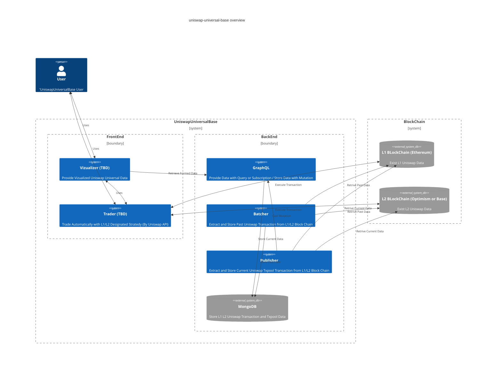

# uniswap-universal-base
Keepping storing uniswap universal router txpool and transaction data, vizualizing, analyzing, and trading on the base

```mermaid
C4Context

title uniswap-universal-base overview

Person(user, "User", "'UniswapUniversalBase User")

Boundary(b1, "UniswapUniversalBase") {
  

  Boundary(b2, "FrontEnd", "boundary") {
    System(Vizualizer, "Vizualizer (TBD)", "Provide Vizualized Uniswap Universal Data")
    System(Trader, "Trader (TBD)", "Trade Automatically with L1/L2 Designated Stratedy (By Uniswap API)")
  }

  Boundary(b3, "BackEnd", "boundary") {
    System(GraphQL, "GraphQL", "Provide Data with Query or Subscription / Store Data with Mutation")
    System(Batcher, "Batcher", "Extract and Store Past Uniswap Transaction from L1/L2 Block Chain")
    System(Publisher, "Publisher", "Extract and Store Current Uniswap Txpool Transaction from L1/L2 Block Chain")
    SystemDb_Ext(MongoDB, "MongoDB", "Store L1 L2 Uniswap Transaction and Txpool Data")
  }
}

BiRel(user, Vizualizer, "Uses")
BiRel(user, Trader, "Uses")
BiRel(Trader, Vizualizer, "Uses")
BiRel(Trader, L1, "Execute Transaction")
BiRel(Trader, L2, "Execute Transaction")

Rel(Vizualizer, GraphQL, "Retrieve Formed Data")
Rel(Publisher, L1, "Retrive Current Data")
Rel(Publisher, L2, "Retrive Current Data")
Rel(Batcher, L1, "Retrive Past Data")
Rel(Batcher, L2, "Retrive Past Data")
Rel(Batcher, MongoDB, "Store Past Data")
Rel(Publisher, GraphQL, "Cast Mutation")
Rel(GraphQL, MongoDB, "Store Current Data")

Boundary(b4, "BlockChain") {
   SystemDb_Ext(L1, "L1 BLockChain (Ethereum)", "Exist L1 Uniswap Data")
   SystemDb_Ext(L2, "L2 BLockChain (Optimism or Base)", "Exist L2 Uniswap Data")
}

```
