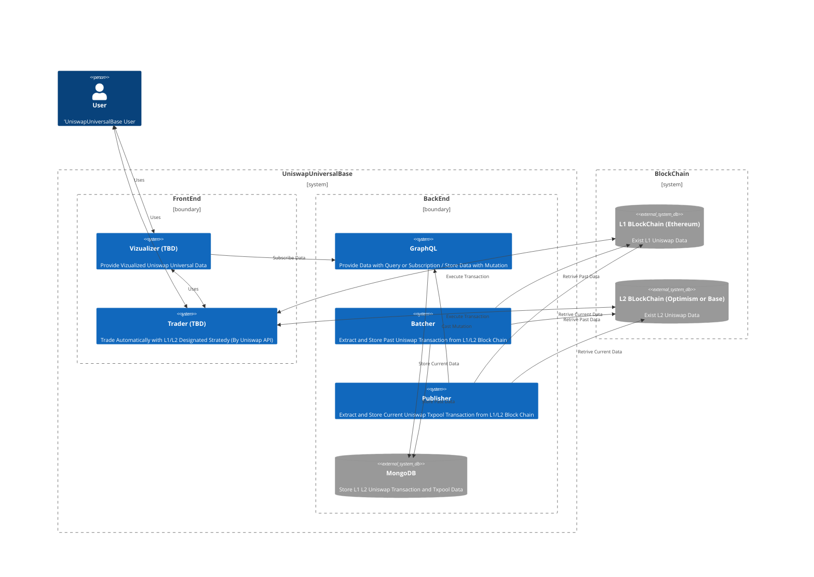

# uniswap-universal-base
Keepping storing uniswap universal router txpool and transaction data, vizualizing, analyzing, and trading on the base

## Uniswap Universal Base Overview

## Components

| Micro Service | Description  | 
| :---: | :--- | 
| MongoDB | Store Univerwap Universal Decoded Data from L1/L2 Blockchain | 
| [GraphQL](https://github.com/HiroyukiNaito/uniswap-universal-graphql) | Provide Subscriptions, Queries, Mutations for the System | 
| [Batcher](https://github.com/HiroyukiNaito/uniswap-universal-batcher) | Extract Past Universal Decoded Data from L1/2 Blockchain and Store to MongoDB | 
| [Publisher](https://github.com/HiroyukiNaito/uniswap-universal-publisher) | Extract Current Universal Decoded Data from L1/2 Blockchain and Publish Mutation to the GraphQL | 
| Vizualizer (TBD) | Vizualizer Current and Past Uniswap Universal Data by using the GraphQL | 
| Trader (TBD) | Trade by Using Vizualized and Airbitrary Data form Vizualizer and the GraphQL Data with L1/L2 Block Chain (RPC)  | 
